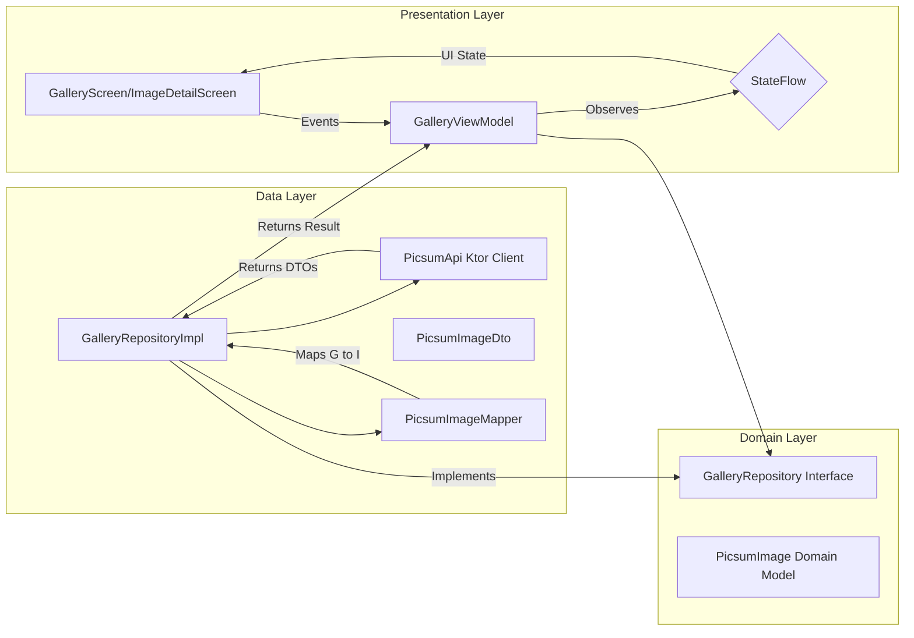

# StoreLab Pictures - Assignment

**Author:** Pradeep Jeswani

An example Android application built with Kotlin Multiplatform and Jetpack Compose, demonstrating modern app architecture and best practices. This project displays a gallery of images fetched from the Picsum API, allowing users to view details and sort the images.

## Screenshots

| Gallery Screen | Detail Screen |
| :---: | :---: |
|  |  |

## Features

-   **Image Gallery:** View an scrollable grid of beautiful pictures from the network.
-   **Dynamic Sorting:** Sort the image gallery by author name or by image dimensions (size).
-   **Image Details:** Tap on any image to view its details, including the author, width, height, and ID.
-   **Clean, Modern UI:** A sleek, minimal user interface built entirely with Jetpack Compose.
-   **Error Handling:** Gracefully handles network errors and displays an informative message to the user.
-   **Loading States:** Shows a loading indicator while fetching images for a smooth user experience.

## Technical Stack & Key Concepts

This project is a practical demonstration of building a robust, maintainable, and testable Android application using the latest technologies.

### Core Technologies

-   **Kotlin:** The official language for Android development.
-   **Kotlin Multiplatform:** Sharing code between platforms (currently configured for Android, iOS and Desktop).
-   **Jetpack Compose:** A modern, declarative UI toolkit for building native Android UIs.
-   **Coroutines & Flow:** For managing asynchronous operations and building reactive data streams.
-   **Ktor Client:** A modern, multiplatform networking client for making API requests.
-   **Koin:** A pragmatic and lightweight dependency injection framework for Kotlin.

### Clean Architecture

The project follows a strict Clean Architecture pattern, separating the codebase into three distinct layers: Presentation, Domain, and Data. This separation of concerns makes the app more scalable, maintainable, and testable.



-   **Presentation Layer:** Built with Jetpack Compose and `ViewModel`. Its role is to display the UI and delegate user actions to the `ViewModel`. It is completely unaware of where the data comes from.
-   **Domain Layer:** This is the core of the application. It contains the business logic, It follows interface pattern, domain models (`PicsumImage`), and repository interfaces (`GalleryRepository`). It is completely independent of the other layers.
-   **Data Layer:** Responsible for providing data to the Domain layer. It contains the implementation of the repository interface (`GalleryRepositoryImpl`), the Ktor API service, and mappers to convert data transfer objects (DTOs) to domain models (PicsumImage).

### MVI & Reactive State Management

The app uses a Model-View-Intent (MVI) pattern for state management, powered by Kotlin's `Flow`.

-   **Unidirectional Data Flow:** The UI observes a single `StateFlow<GalleryUiState>` from the `ViewModel`. User actions (like tapping a sort button) are sent to the `ViewModel` as events. The `ViewModel` processes these events, updates its state, and the UI automatically reflects the new state.
-   **Reactive Data Streams:** The `ViewModel` uses the `combine` operator to merge multiple data sources (the result from the network, the current sort option, and the selected image) into a single, cohesive UI state. The `stateIn` operator then converts this into a hot `StateFlow` that efficiently shares the state with the UI, surviving configuration changes.

### Comprehensive Testing Strategy

Testability is a first-class citizen in this project.

-   **Data Layer Testing:** The `GalleryRepositoryImpl` is unit tested by providing a mock implementation of the `PicsumApi`, allowing verification of its logic without making actual network calls.
-   **Presentation Layer Testing:** The `GalleryViewModel` is extensively tested by mocking the `GalleryRepository`. The tests verify that the `ViewModel` correctly handles different scenarios (success, failure, user actions) and emits the expected `UiState`. The use of `runTest` and `TestDispatcher` ensures that the tests for coroutines are reliable and deterministic.

## How to Build and Run

1.  **Clone the repository:**
    ```bash
    git clone https://github.com/your-github-username/StorelabAssignment.git
    ```
2.  **Open in Android Studio:**
    Open the project in the latest version of Android Studio.
3.  **Run All Tests:**
    To ensure everything is working as expected, run the custom Gradle task that executes all unit tests.
    ```bash
    ./gradlew runAllTests
    ```
4.  **Run the App:**
    Select the `composeApp` run configuration and deploy it to an Android emulator or a physical device.

## License

Copyright (c) 2026 Pradeep Jeswani

This project is licensed under the MIT License - see the [LICENSE](LICENSE) file for details.
